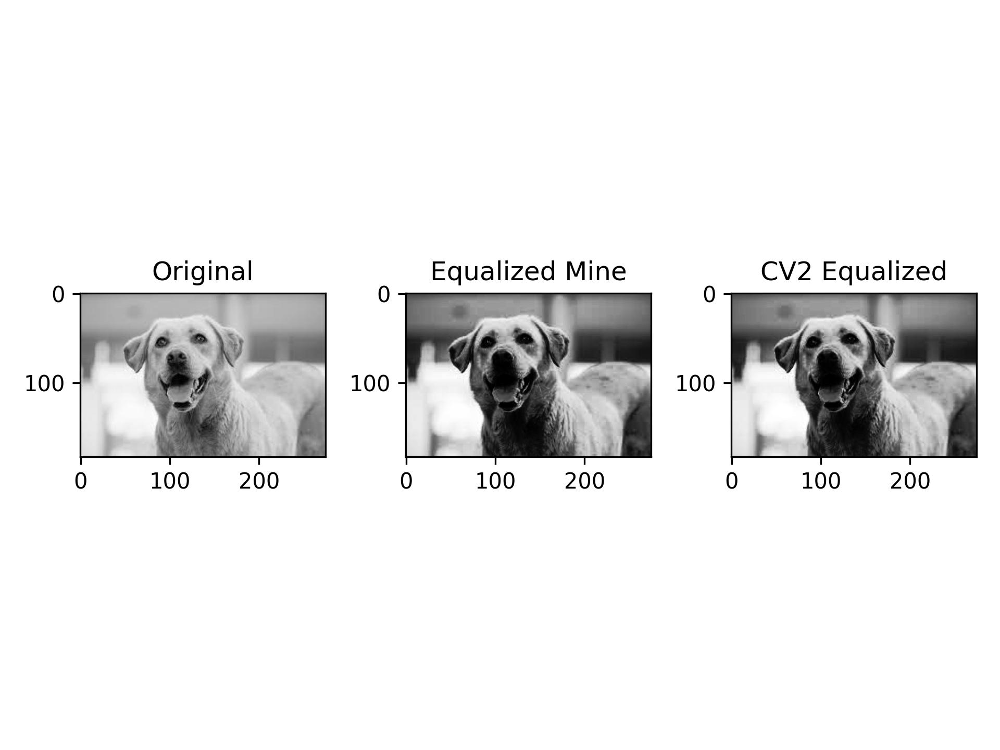
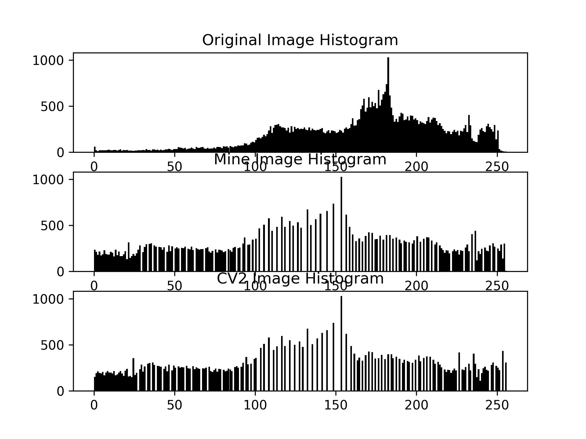
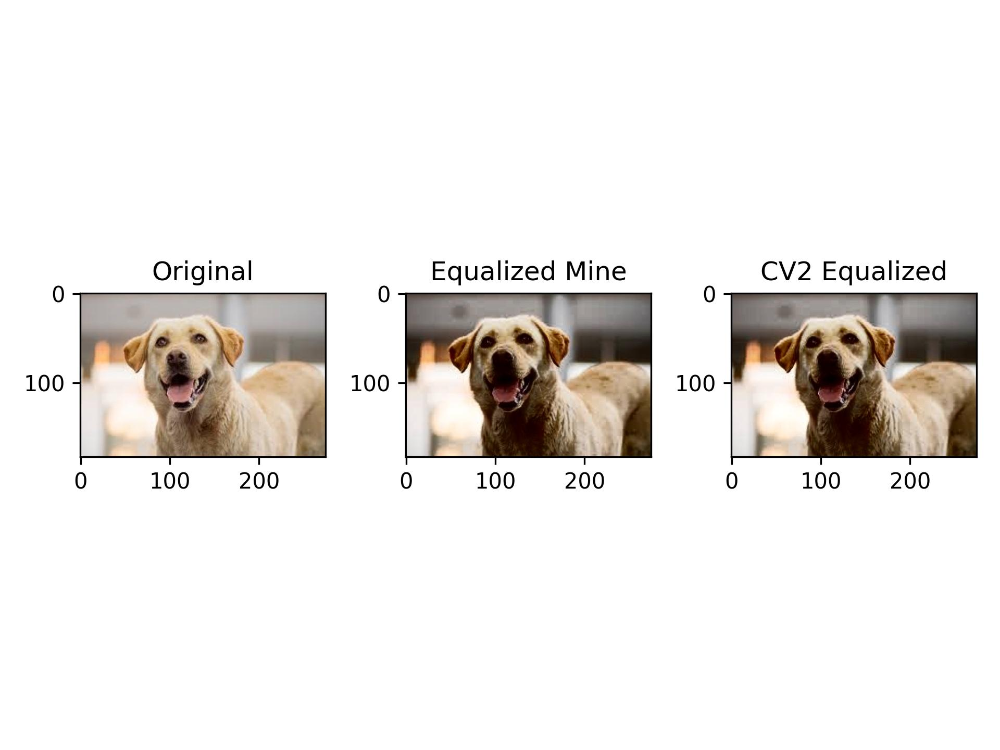
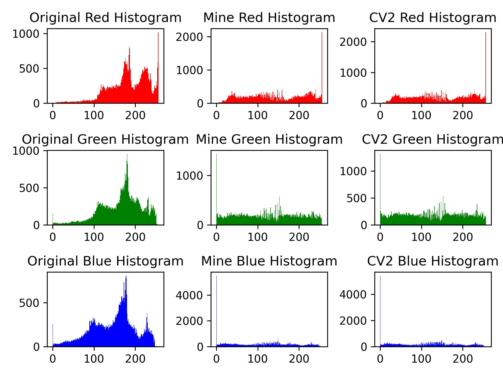
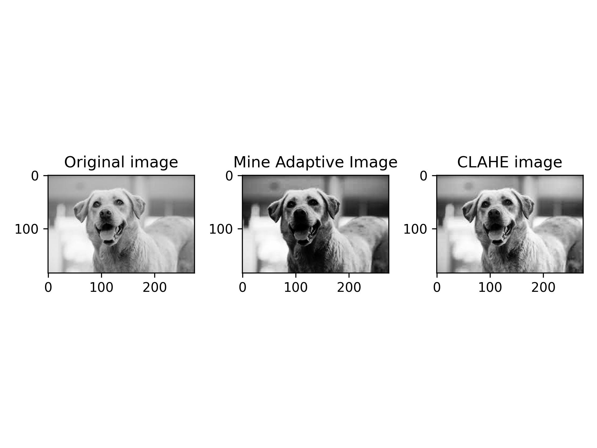
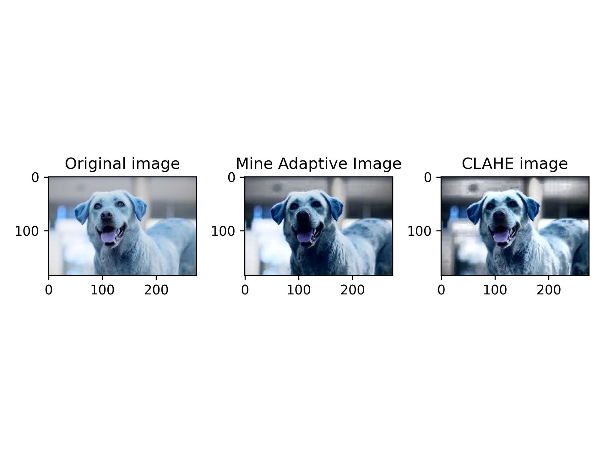
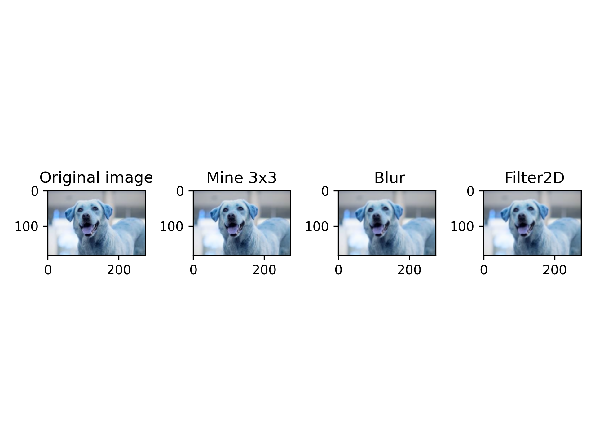
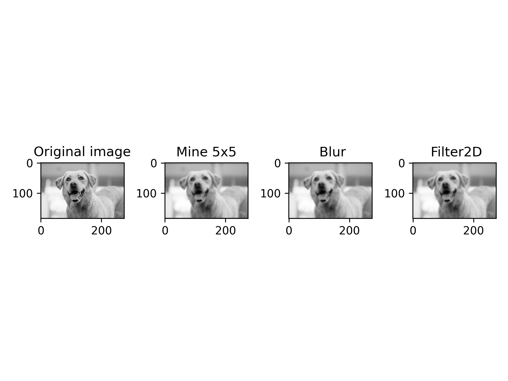
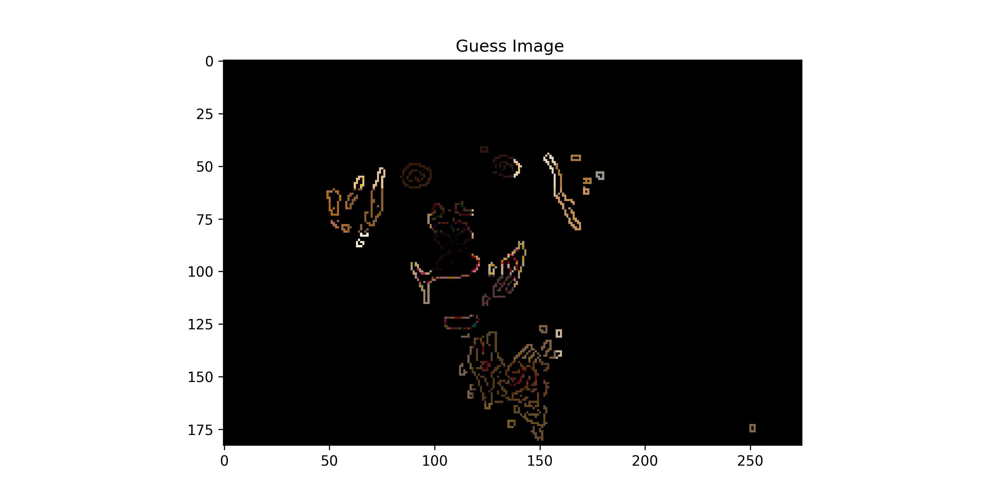
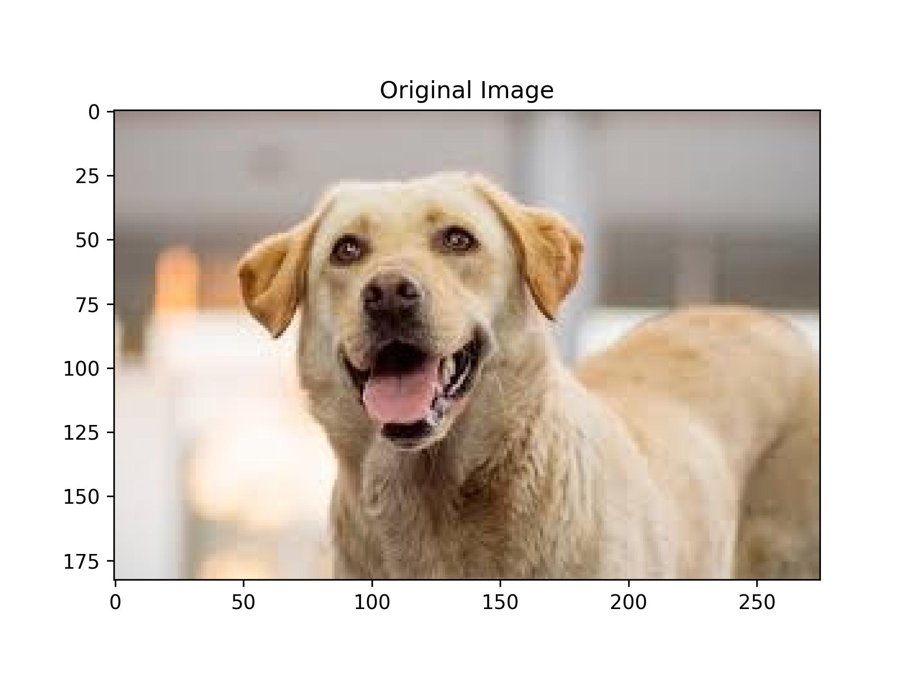

# Project 1: Image Filtering
##### By Debashis Gupta (Graduate Student)

## Part 01: Histogram, Adaptive Histogram and Convolution
### Histogram Equalization for Color and Gray Image
A color image is composite of 3 channels Red (R), Green (G), and Blue (B) whereas a gray image can be viewed as 2D matrix with intensity values ranges from 0 to 255. Histogram equalization is a technique to process images in order to adjust the contrast of the image by changing the intensity distribution of the histogram of the image. Although the histogram equalization of a grayscale image is very straightforward as only need to adjust the distribution of the gray image, the color image can be a little more complicated. To calibrate the contrast of the color image I used the following *Algorithm**1*** - 
1. Change the color RGB image to YCrCb color space and take the Y channel into account as this channels contains the intensity values.
2. Perform the histogram equalization on the Y channel and then assign back to the YCrCb image.
3. Finally, take the YCrCb image with the new intensity of Y channel and then assign back to the RGB color image.
4. The new color image will be the output after histogram equalization.

The following figure shows the histogram equalization for both Gray and RGB images along with the histogram and compare with the method of the histogram equalization from OpenCV (CV2).
<!--  

 -->

| Gray Scale Image             | Color Image  
| :---------------- | :------: | 
|| 
|       |      

## Adaptive Histogram Equalization 
Adaptive Histogram Equalization differs from normal hisogram equalization in that it computes the several histograms, each of which corresponds to a distinct section of the image and uses them to redistribute the intensity values of the image. However, for both noraml and adaptive histogram equalization I transformed the color space according to the aforementioned Algorithm 1
Following the definition, my adaptiveHistEq follows the below steps of *Algorithm**2*** :
1. If image is RGB then Follow the Algorithm 1 for the color space transition and take channel Y.
2. Take an odd window size. (for this example, I took 3x3 window size) for creating sections which will be applied to the adaptive histogram technique as defined before.
3. Perform histogram equalization of each of the channels and take the middle values from 3x3 window sections of the image.
4. Assign the middle values back to the original image and return the histogram of the new image.
   
   The output adaptive histogram is shown below :

| Gray Scale Image             | Color Image  
| :---------------- | :------: | 
|| 

   For a comparison study, I use CLAHE stands for Contrast Limited Adaptive Histogram Equalization from OpenCV library. Although CLAHE use inherent parameters to smooth the image and perform histogram equalization which gives better result, mine results also showed significant result almost identically to CLAHE.

   ## Convolution Method using 3x3 and 5x5 Kernel Size 
   In image processing, convolution is the technique used for transforming an image by applying a kerne over each pixel and its local neighbors accorss the image. The following algorithm shows how description how convolution works:

   1. If the image is RGB, then extract the channels R,G,B from the image else remain the same.
   2. Apply padding on the input image for performing localization convolution and to do this <ins> numpy.pad() </ins> function is used by passing the padding_height and padding_width as arguments. Folowing equations help - 
      1. padding_height = (kernel_height-1) // 2
      2. padding_width = (kernel_width-1) // 2
   3. Used numpy function <ins>numpy.lib.stride_tricks.sliding_window_view()</ins> which takes padded image with the window size (kernel.shape) and returns tiles of the window size of the image.
   4. Now perform convolution sum with the kernel and the window size obtained from the step 3.
   5. Return the image.
   
For simplicity in comparing with filter2D function of OpenCV, kernel values are kept as for blurring image. For making a double check I also compare with OpenCV Blur function which gives exact results.

| Gray Scale Image  (3x3)           | Color Image  (3x3)
| :---------------- | :------: | 
|| 
| Gray Scale Image   (5x5)          | Color Image  (5x5)
|| 

## Comparision of Time  

| System             | Mine      |          | OpenCV    |          |
| :----------------: | :-------: | :------: | :-------: | :------: |
|                    | GrayScale | Color    | GrayScale | Color    |
| Histogram          | 0\.0042   | 0\.00089 | 0\.00060  | 0\.00037 |
| Adaptive Histogram | 0\.00083  | 0\.0098  | 0\.0003   | 0\.0087  |
| Convolution 3x3    | 0\.00301  | 0\.0080  | 0\.00154  | 0\.0015  |
| Convolution 5x5    | 0\.00544  | 0\.0085  | 0\.000543 | 0\.0050  |

## Part 02: Fun Filter
While thinking this challenge I planned to make a guess game using the combination of the filters and some bitwise operations. So the algorithm is -
1. Take the image.
2. First the brightness and contrast of the input image is changed using OpenCV filter <ins>cv2.convertScaleAbs()</ins> to adjust the brightness and contrast according to the gameplay.
3. Then apply the Gaussian filter <ins>cv2.GaussianFilter()</ins> to make the blurry effect of the image to confuse the viewer.
4. Afterwards, Canny filter is applied to get some specific edge of the blurred image as hints to the viewer for guessing the orginal image.
5. Finally, the bitwise operation OR followed by AND is applied to the image so that the edge and blur effect along with the lower brightness and contrast so that the image can be hard to predict.

The output is shown below

| Guess The Image           | Original Image |
| :---------------- | :------: | 
|| 

## Part 03: Cameo App 
This part is a modified version of the original [github repo](https://github.com/PacktPublishing/Learning-OpenCV-4-Computer-Vision-with-Python-Third-Edition) where the program shows two video stream side by side and one of the frame shows the effect of histogram equalization, adaptive histogram equalization, smoothing, unsharpness and edge selection. To achieve I used the following commands from the OpenCV library:
1. [cv2.equalizeHist](https://docs.opencv.org/3.4/d8/dbc/tutorial_histogram_calculation.html): Applies histogram equalization technique to the frame by frame of the video stream.
2. [cv2.createCLAHE](https://docs.opencv.org/4.x/d6/dc7/group__imgproc__hist.html): This function is used to apply the adaptive histogram equalization on the video stream.
3. [cv2.blur](https://docs.opencv.org/4.x/d4/d13/tutorial_py_filtering.html): It helps to blur the frame of the video stream. This function uses low-pass filter to blur the image.
4. [cv2.GaussianBlur](https://docs.opencv.org/4.x/d4/d13/tutorial_py_filtering.html) and [cv2.addWeighted](https://docs.opencv.org/4.x/d4/d13/tutorial_py_filtering.html): These two functions are used to smooth the image removing any noise and sharpening the image. 

## Credits  
1. [OpenCV Documentation](https://docs.opencv.org/4.x/) helps a lot to understand the implementation of the built-in functions and also provides a way to understand the parameters that are used to modify the image.
2. [Numpy Array](https://numpy.org/doc/stable/reference/generated/numpy.array.html) provides a way to make faster implementations and deal with the 2 and 3 dimensional arrays. Additionally, I came to fimiliar with the usage of vectorize operations which helps to replace the nested for loops extensive computation.
3. **ChatGpt**: I used this artificial intelligence chatbot as a secondary help for getting started with the information as early phase and also get some code suggestions for vectorizing operations improvements. Additionally, I modified the functionality of suggested code and commands to suit my specifi implementation task. One thing I **admired that**  during adaptive histogram coding I code for taking middle values of the window section of the image using a traditional array fetch step which works well. However, I seeked for another way to improve the code structure when I got a suggestion from ChatGPT which is **array[:,:,1,1]**  inline code to get the center value of the window section.
4. I read the following medium blogs for getting my understanding of -
   1. [A Tutorial to Histogram Equalization - Medium blog](https://medium.com/@kyawsawhtoon/a-tutorial-to-histogram-equalization-497600f270e2)
   2. [Adaptive Touch to Histograms— CLAHE - Medium blog](https://medium.com/@mntalha.kilic/adaptive-touch-to-histograms-clahe-4b0db004e2bd)
   3. [Standford AI Lab](https://ai.stanford.edu/~syyeung/cvweb/tutorial1.html)
   4. [The University of Edinburgh](https://homepages.inf.ed.ac.uk/rbf/HIPR2/filtops.htm)
5. **Peer Graduate**: Specially thanks to Cade to help me in understanding specifically how to construct window section histogram for adaptive histograms. Also thanks to Nathan for breaking down the code implementation of cameo pre-build code together. Gratitude to Prof Dr. Paúl Pauca for his direction on how to implement the RGB color space transformation to YCrCb and guidance.
