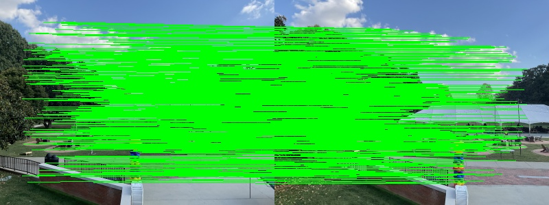

# Project 2
Debashis Gupta || Graduate Student

## Part 02 : Panorama Creation Tool 
In this project, I worked on creating a panorama using three images without using the sticher built-in function in opencv and follow this [resource](https://pyimagesearch.com/2016/01/11/opencv-panorama-stitching/). The algorithm used in this resource is as follows

#### Step 1 Detecting the keypoints and descriptors
#### Step 2 Matching the keypoints of the given images
#### Step 3 Wrapping the images with corresponding keypoints using CV2.warpPerspective
#### Step 4 Drawing the matches and stiching the images.

## <span style="color:blue">Surprising Element and Correction</span>
<div style="text-align:justify">
So this resource lacks the ability to stich more than two images together using any keypoints and descriptors like SIFT, ORB, FAST, and Harris. The reason for this failure is the code does not take into account the black pixels added while stiching the images. This makes it uneffective while drawing the matching between the previously stiched two images and the new one. As a result, no algorithm will work properly. So i made a function called <span style="color:red">trim</span>.
</div>
With aforementioned steps, the <span style="color:red">trim</span> function will cut off the black pixels that gives the detectors to draw the matching keypoints between the previously stiched and new image. The code is as below :

```
def trim(image):	
	if not np.sum(image[0]):
		return trim(image[1:])
	if not np.sum(image[-1]):
		return trim(image[:-2])
	if not np.sum(image[:,0]):
		return trim(image[:,1:])
	if not np.sum(image[:,-1]):
		return trim(image[:,:-2])
	return image
```
<div style="text-align:justify">
This function will take the stiched image and perform a recursive transformation to cut off the black pixels and returns the trimmed image which will still have the strong matching keypoints discovered by the detectors.
</div>

## Applying the Algorithms on creating Panorama and Comparision in Efficiency

For this experimental section I have taken this following image to be used in panorama.

| <center>Left  </center>           | <center>Middle </center>| <center>Right </center>| 
| :---------------- | :------: | ------------:|
||||

### SIFT
<div style="text-align:justify">
Applying the sift algorithm on creating a panorama with these images gives the following result. This algorithm computes 378 matching keypoints between the left and middle images and 304 matching keypoints between the middle and right images.  The following table shows the total matching keypoints while creating the panorama with these images.
</div>


| <center>Left-Middle  </center>           | <center>Middle-Right </center>| <center>Left-Middle & Middle-Right </center>| 
| :---------------- | :------: | ------------:|
|<center>378</center>|<center>304</center>|<center>440</center>|

<div style="text-align:justify">
The following images shows the matching keypoints on the final panorama and the resultant output image.
</div>

| <center>Left-Middle</center>           | <center>Middle-Right</center>| 
| :---------------- | :------: |
|||

| <center>Keypoints</center>           | <center>Resultant Panorama </center>| 
| :---------------- | :------: |
|||


### ORB
<div style="text-align:justify">
Applying the orb algorithm on creating a panorama with these images gives the following result. This algorithm computes 101 matching keypoints between the left and middle images and 66 matching keypoints between the middle and right images.  The following table shows the total matching keypoints while creating the panorama with these images.
</div>


| <center>Left-Middle  </center>           | <center>Middle-Right </center>| <center>Left-Middle & Middle-Right </center>| 
| :---------------- | :------: | ------------:|
|<center>101</center>|<center>66</center>|<center>109</center>|

<div style="text-align:justify">
The following images shows the matching keypoints on the final panorama and the resultant output image.
</div>

| <center>Left-Middle</center>           | <center>Middle-Right</center>| 
| :---------------- | :------: |
|||

| <center>Keypoints</center>           | <center>Resultant Panorama </center>| 
| :---------------- | :------: |
|||

<div style="text-align:justify">
</div>
<div style="text-align:justify">
</div>

### FAST
<div style="text-align:justify">
Applying the fast corner algorithm on creating a panorama with these images gives the following result. For computing the descriptors from the keypoints achieved from using fast I used ORB detector. This algorithm computes 634 matching keypoints between the left and middle images and 371 matching keypoints between the middle and right images.  The following table shows the total matching keypoints while creating the panorama with these images.
</div>


| <center>Left-Middle  </center>           | <center>Middle-Right </center>| <center>Left-Middle & Middle-Right </center>| 
| :---------------- | :------: | ------------:|
|<center>634</center>|<center>371</center>|<center>687</center>|

<div style="text-align:justify">
The following images shows the matching keypoints on the final panorama and the resultant output image.
</div>

| <center>Left-Middle</center>           | <center>Middle-Right</center>| 
| :---------------- | :------: |
|||

| <center>Keypoints</center>           | <center>Resultant Panorama </center>| 
| :---------------- | :------: |
|||

### Harris
<div style="text-align:justify">
Applying the harris corner algorithm on creating a panorama with these images gives the following result. For computing the descriptors from the keypoints achieved from using fast I used ORB detector. This algorithm computes 461 matching keypoints between the left and middle images and 298 matching keypoints between the middle and right images.  The following table shows the total matching keypoints while creating the panorama with these images.
</div>


| <center>Left-Middle  </center>           | <center>Middle-Right </center>| <center>Left-Middle & Middle-Right </center>| 
| :---------------- | :------: | ------------:|
|<center>461</center>|<center>298</center>|<center>505</center>|

<div style="text-align:justify">
The following images shows the matching keypoints on the final panorama and the resultant output image.
</div>

| <center>Left-Middle</center>           | <center>Middle-Right</center>| 
| :---------------- | :------: |
|||

| <center>Keypoints</center>           | <center>Resultant Panorama </center>| 
| :---------------- | :------: |
|||

### Analysis

<div style="text-align:justify">
From the aforementioned tables, it is clearly seen that FAST with the combination with ORB can extract more similiar matching points than others. It also comes with more detailed panorama than the others as naturally it detects for useful connectors from the images for stiching them. Although Harris with ORB also shows promising algorithm for stiching the images. For this experiment, we can also conclude that the black pixels will break the stiching as they hinder the matching points.
</div>
<div style="text-align:justify">
</div>