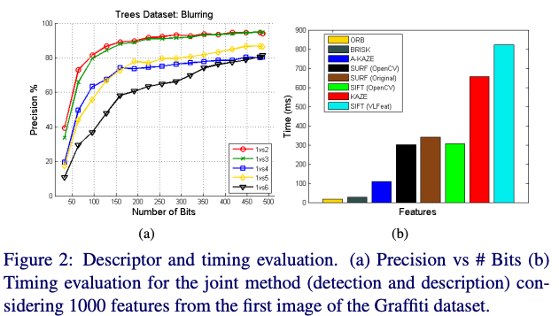

# Project 2
Debashis Gupta || Graduate Student

## Part 01 : Explore your own topic 

I choose Accelaerated-KAZE (A-KAZE) as the descriptor I want to describe. The decription will follows like this: introduction to the A-KAZE, Mathematical Intuition, Evalution, Code, and Conclusion.

### Introduction
<div style="text-align:justify">
The utilisation of the A-KAZE feature extraction technique, which stands for "Accelerated-KAZE," is prevalent in the fields of computer vision and image processing. The purpose of its creation was to provide enhanced and dependable capabilities for extracting features, making it an improved iteration of the initial KAZE (Kernels for Accelerated-Zone of Extrema) algorithm. A-KAZE is particularly advantageous in tasks such as photo matching, object detection, and tracking. Traditional feature extraction algorithms like SIFT (Scale-Invariant Feature Transform), SURF (Speeded-Up Robust Features), and ORB (Oriented FAST and rotated BRIEF) have been widely utilised in computer vision applications. However, it is important to note that these algorithms possess certain limits with regards to their ability to process data in real-time, their capacity to handle large amounts of data, and their ability to adapt to different image situations. A-KAZE effectively tackles these concerns by integrating several innovations.
</div>

### Mathematical Background
#### Feature Detection
<div style="text-align:justify">
The A-KAZE algorithm utilises a feature detection technique to do an analysis of an image with the purpose of identifying keypoints or points of interest. The aforementioned keypoints are identifiable segments inside an image that serve many purposes in the field of computer vision, such as picture matching and object recognition. The A-KAZE detection technique encompasses several distinct steps, which involve the following subsequent procedures. The A-KAZE technique is utilised to generate a scale-space representation of the input image. This representation consists of multiple image scales generated through the application of Gaussian smoothing with varying standard deviations. This enables the discernment of essential aspects across several levels of analysis. A-KAZE subsequently employs the Difference of Gaussians technique to accentuate regions within the image that exhibit varying levels of intensity. The process of identifying keypoints as extrema within the pyramid ensures that both scale and location invariance are preserved. The A-KAZE algorithm will assign an orientation to each keypoint by utilising the local gradient information. This serves to advance the overarching goal of attaining rotation invariance.
</div>

#### Feature Description

<div style="text-align:justify">
Upon the identification of keypoints, A-KAZE algorithm proceeds to calculate feature descriptors that include information regarding the local image structure surrounding each keypoint. These descriptors are utilised for tasks that include matching and recognition. The development of the A-KAZE feature descriptors is guided by the following principles: A-KAZE employs a modified variant of the Local Binary Pattern (LBP) to collect texture data in proximity to each keypoint. The concept of gradient refers to the rate of change of a function with respect to its variables. It provides valuable information about the direction and magnitude of the steepest ascent In order to effectively capture edge and geometry aspects, the descriptor incorporates gradient information as well. Weighted histograms are employed by A-KAZE in order to amalgamate information derived from the immediate vicinity of the keypoint. The process of weighting ensures that regions or aspects of greater importance have a greater impact on the overall description compared to those of lesser value.
</div>

### Evaluation
<div style="text-align:justify">
Pablo et. al[1] presents extensive evaluation on the benchmark dataset by Oxford[2] and make a comparison of their results with the other state-of the art approaches like BRISK, ORB, SURF, SIFT and KAZE. Although, the A-KAZE is computationally expensive than BRISK and ORB, this approach is much more faster than SURF, SIFT and its own variant KAZE. Along with that, the authors introduced Modified-Local Difference Binary (M-LDB)[1] descriptor that makes this algorithm highly efficient and exploits the gradient information from the nonlinear scale space. The following figures show the efficacy of this algorithm over the benchmark datasets.
</div>

<center>

 

<center>Figure1 : Binary Test of LDB and M-LDB</center>

 

</center>

<div style="text-align:justify">
Figure 1 shows the performance difference between Local Difference Binary (LDB) and Modified Local Difference Binary (M-LDB). The M-LDB creates more precised keypoints detection which is adopted by A-KAZE. The Figure 2 is describing the precision and time required for mentioned state-of-the-art algorithms where A-KAZE shows significant performance than most of the other algorithms. 
</div>

### CODE

```
import cv2

# Load the input image
image = cv2.imread('../Image/andrew.JPG')

# Create an A-KAZE detector and extractor
akaze = cv2.AKAZE_create()

# Detect keypoints and compute descriptors
keypoints_akaze, descriptors_akaze = akaze.detectAndCompute(image, None)

# Draw keypoints on the image
akaze_image = cv2.drawKeypoints(image, keypoints_akaze, None,color=(0,0,255), flags=cv2.DRAW_MATCHES_FLAGS_DRAW_RICH_KEYPOINTS)


# Save the output image with keypoints
cv2.imwrite('AKAZE.jpg', akaze_image)

# Display the number of detected keypoints
print(f"Number of Keypoints Detected: {len(keypoints_akaze)}")

```

#### Output image

 

The red points are the keypoints detected by AKAZE. The total number of such points are 7239. 

### Conclusion 
<div style="text-align:justify">
This paper presents a novel technique for effectively identifying and describing features within nonlinear scale environments. Compared to previous nonlinear scale space methods such as KAZE and BFSIFT, the proposed methodology significantly enhances the speed of feature identification by the utilisation of Fast Explicit Diffusion (FED) numerical schemes within a pyramidal framework. This paper also introduces the Modified-Local Difference Binary (M-LDB) descriptor, which is very effective, exhibits scale and rotation invariance, and requires minimal storage. The combination of these advancements constitutes the "Accelerated-KAZE" (A-KAZE) method for extracting features, which is a valuable tool in computer vision applications due to its ability to efficiently and accurately analyse features in nonlinear scale spaces.


</div>


## References
[1] [Pablo F Alcantarilla, Jes s Nuevo, and Adrien Bartoli. Fast explicit diffusion for accelerated features in nonlinear scale spaces. Trans. Pattern Anal. Machine Intell, 34(7):1281 1298, 2011.](https://projet.liris.cnrs.fr/imagine/pub/proceedings/BMVC-2013/Papers/paper0013/abstract0013.pdf)

[2]K. Mikolajczyk, T. Tuytelaars, C. Schmid, A. Zisserman, J. Matas,F. Schaffalitzky, T. Kadir, and L. Van Gool. A comparison of affine region detectors. Intl. J. of Computer Vision, 65(1-2):43–72, 2005.

[3][Opencv-implementation AKAZE](https://docs.opencv.org/3.4/db/d70/tutorial_akaze_matching.html)
