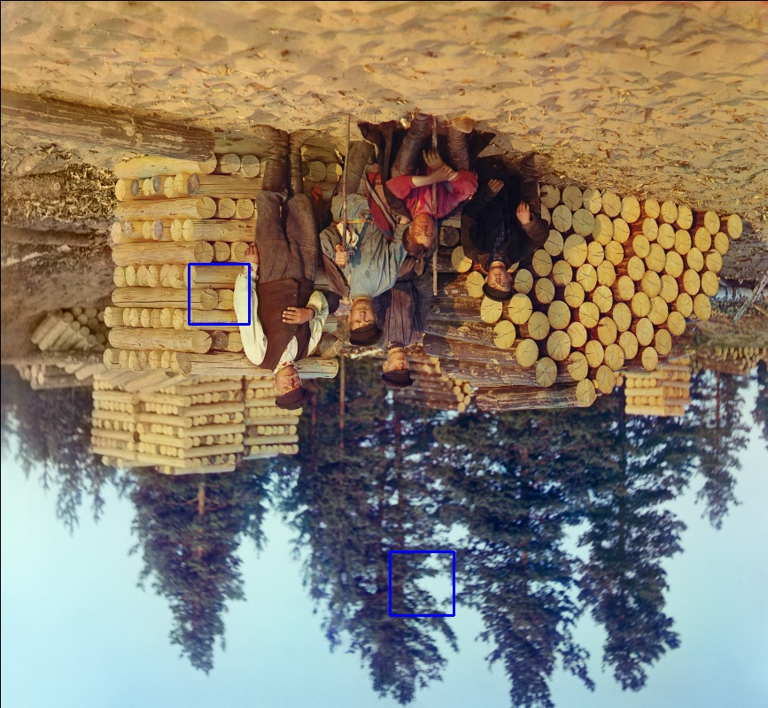

# PROJECT 3 : Face Detection and Recognition
Debashis Gupta | Graduate Student

## PART 1 : Face Detection - HAAR Classifier 

To check the invariance properties of face detection against the translation, rotation and scale images I consider two types of images which represent a single face (my image) and multiple faces image (woodcutters). My intention was to check these geometry properties with combination of single and multiple faces to represent a clear distinction towards these features.

<h3 style="color:red"> Scale Property </h3> To check whether the face dectection technique using Haar classifier is scale invariant or not, I scaled the two types of images from 1.0 to 2.5 with an interval of 0.5 increase within the range. The results are in the following -

| 
Scale  
           | 
Single Face 
| 
Multiple Face 
| 
| :---------------- | :------: | ------------:|
|1.0x|||
|1.5x|||
|2.0x|||
|2.5x|||

Figure 1.1 : Haar Classifier on Scale Transformation

<h4 style="color:blue"> Observation </h4> The results clearly indicate that face detection is scale invariant. However, it is visible that Haar Classifier performs consistently in detecting one face image where shows inconsistency in multple face included images as shown in Figure 1.1 for scale 1.5x to 2.5x.

<h3 style="color:red"> Rotation</h3> To check whether the face dectection technique using Haar classifier is scale invariant or not, I took 0,45,90,135, and 180 degree angles for rotating both images. The results are in the following -

| 
Angle (Degree)  
           | 
Single Face 
| 
Multiple Face 
| 
| :---------------- | :------: | ------------:|
|
0
|||
|
45
|||
|
90
|||
|
135
|||
|
180
|||

Figure 1.2 : Haar Classifier on Rotation Transformation

<h4 style="color:blue"> Observation</h4> The results shown inf Figure 1.2 were quite interesting for me. First of all, the experimental result shows that Haar Classifier is not rotation invariant. For detecting one face image, Haar Classifier was not able to detect while rotating on the other hand in case of multiple face, it provides some false positive detection. The most surpersing element for me was, in case of 180 degree rotation, Haar Classifier still did not recognize the face for single image and produced some false detection for multple images, which was totally oposite to my expectation. 

<h3 style="color:red"> Translation </h3> In geometry transformation, translation of a face means that the face is shifted for some pixels from its origin. To translate a face, I uses opencv warpAffine transformation to shift the image x pixels right and y pixels down from the origin. Note that the empirical study shows that this transformation can include some black pixels that do not bother the detection technique. The experimental results show -

| 
Shift  Right  
           | 
Shift  Down  
           | 
Single Face 
| 
Multiple Face 
| 
| :---------------- | :---------------- | :------: | ------------:|
|
50
|
50
|||
|
75
|
75
|||
|
125
|
125
|||
|
150
|
150
|||
|
175
|
175
|||
|
200
|
200
|||

Figure 1.3 : Haar Classifier on Translation Transformation

<h4 style="color:blue"> Observation</h4> The results depict that Haar Classifier is invariant to translation transformation. Nevertheless, Haar performs better in detecting a single face than multiple ones. The analysis shows that until the full frame of the face excedes the window the Haar Classifier can detect the face. In figure 1.3, (150,150) shifts shows that the Haar can perfectly identify the face for both single and multiple faces although, it shows false positive in detecting multiple faces. However, when the image is shifted to (175,175) extreme points where the mostly face features are discarded, as expected, the Haar Classifier can not detect the face.

Interesting fact is that the Haar Classifier can not detect if the face is partially visiable in the frame shown in the case of (200,200) shift in figure 1.3. Since, Haar classifier always look for the full face points in its xml file it can not detect a partial face points when the face is partially visiable to it. 
 

<!-- Part 1 ends here -->

## PART 2 : Face Detection - Other Approaches (Used - HOG and CNN : MMOD)

To compare with face detection using the Haar Classifier with Histogram of Oriented Gradients (HOG) and Max-Margin (MMOD) CNN face detector, for simplicity, I took only single face image. The intention of this work is to find whether the later two approaches perform better than the Haar classifier in terms of the invariance property of the PART-1 aformentioned geometric transformation. To make a clear distinction between these techniques, I used the pictorial comparision view to ease to look at the difference among them. Please note, that the experimental setup is exactly the same as the Part 01.

<h3 style="color:red"> Scale </h3> 

| 
Scale  
           | 
Haar Classifier  
           | 
HOG
| 
MMOD
| 
| :---------------- | :---------------- | :------: | ------------:|
|
1.x
||||
|
1.5x
||||
|
2.0x
||||
|
2.5x
||||

Figure 2.1 : Three approaches for Scale Transformation

<h3 style="color:red"> Rotate </h3> 

| 
Angle (Degree)  
           | 
Haar Classifier  
           | 
HOG
| 
MMOD
| 
| :---------------- | :---------------- | :------: | ------------:|
|
0
||||
|
45
||||
|
90
||||
|
135
||||
|
180
||||

Figure 2.2 : Three approaches for Rotate Transformation

<h3 style="color:red"> Translation </h3> 

| 
Shift(X,Y)  
           | 
Haar Classifier  
           | 
HOG
| 
MMOD
| 
| :---------------- | :---------------- | :------: | ------------:|
|
(50,50)
||||
|
(75,75)
||||
|
(125,125)
||||
|
(150,150)
||||
|
(175,175)
||||
|
(200,200)
||||

Figure 2.3 : Three approaches for Translation Transformation

<h4 style="color:blue"> Observation</h4> As expected, in case of scale invariance, the three approaches - Haar Classifier, HOG, and MMOD - performed exactly the same showing successfull face detection irrespective of the changes made by the scale ratio. Following that, in case of rotation, all the detection techniques failed to detect the face while the image was rotated on the interval of 45 degree starting from 0 to 180. 

However the interesting fact is noticed while performing the translation. In this case, the experimental setup is kept exactly same as before (Part-01). As shown in the figure 2.3, for the extreme point of shifting the face from its original position i.e. 175 and 200 pixels shift for right and bottom, the Haar Classifier could not detect the face as previously found because of losing some important face keypoints due to the shifting.  However, the HOG and MMOD both detection strategies successfully detected the face in shifted image which clearly indicates the supremacy of these algorithms over Haar classifier. 

<h3 style="color:blue"> Summary Table</h3> 

| 
Technique
           | 
Scale 
           | 
Rotation 
| 
Translation 
| 
| :---------------- | :---------------- | :------: | ------------:|
|
Haar Classifier | 
 Invariant | 
 Not Invariant |
 Paritally Invariant (Failed in partial visiable face) |
|
HOG|
Invariant | 
 Not Invariant |
  Invariant|
|
MMOD|
Invariant | 
 Not Invariant |
  Invariant|

<!-- Part 2 ends here -->

### Part 3: Augmented Reality Filter

This project was the most interesting part that helped me to learn more about how the social media filter is implemented and how it works along with making me in funny posters. The following figure 3 is a short span time of video that represents the work. There is a brief discussion how my filter works -

<h4 style="color:red">How do these Filters Work?</h4>

<b><i>What types filter has been used</i>:</b> I have used hair, nose and eye filter on the frame of the recording video.

<b><i style="color:green">Functions Used & Methodology</i>:</b>

1. resize_with_aspect_ratio: The function resize_with_aspect_ratio takes the frame as its input, along with a specified width or height (or both), and carries out a resizing operation on the image while maintaining its original aspect ratio. The function calculates the revised dimensions by considering the provided width or height, while preserving the aspect ratio. Following this, the image undergoes resizing using the cv2.resize function provided by the OpenCV library, utilising the specified interpolation approach. The function described above has a practical application in the context of resizing images while maintaining their original proportions.
2. overlay_image_alpha: The overlay_image_alpha function accepts four parameters: img (the base image), img_overlay (the image to be overlaid), pos (the position on the base image), and alpha_mask (the alpha mask). The function superimposes the image overlay over the image at the designated point, taking into account the level of transparency determined by the alpha mask. The function computes the appropriate regions for overlay and merges the two images by merging their RGB channels with the alpha channel, resulting in a composite image that exhibits transparency. 
3. How the filters are applied: I used the haar classifier to calculate the face and eye region  and use the overlay_image_alpha function to put the filter on the detected regions respectively. Additionally, I used the calculation nose face ratio that helps me to approximate the nose position and later used the overlay function to apply the nose filter on it.

<video width="700" height="600" controls>
  <source src="./part_3_funny_video.mp4" type="video/mp4">
  Your browser does not support the video tag.
</video>

Figure 3: Augmented Reality Filter

### Part 4: Face Recognition

For detecting the face recognition, I used EigenFaceRecognizer, FisherFaceRecognizer, and LBHFaceRecognizer. I evaluate the face recognition performance using the <b  style="color:yellow"> traditional machine learning evaluation algorithm such as confusion matrix, finding the Recall, Precision, and Accuracy score. </b> The training dataset i, I used my face along with my three friends. Total dataset is of 1505 images including my face along with my three friends (Nathan, Nikhil, and Christopher. BIG THANKS!). <i>For experimental setup,</i> I made this multiclass learning into binary classification where my face is true label and other faces are false label. 

<h5>Code Flow - Algorithm </h5>

1. First the code will ask for what type of model (e for Eigen, f for Fisher, and l for LBH) you want to use.
2. Then it will ask for if you want to add new data image or want to use existing ones.
3. Then model will be trained using the images. During the subfloder will be recognized as label as mentioned in the handout.
4. After finished training, the model will try to predict the face infront the webcam.
5. It quits when 'q' is pressed on keyboard.
  

<h3>How Metrics are evaluated ?</h3>

To evaluate the metrics, I consider True Positive (TP) when my faces (true label) are predicted as me.  False Positive (FP) when I am not on webcam but detected as me.  True Negative (TN) when my face is not present and also does not predict as me.  False Negative (FN) is when no face is present and no frame is detected. 

The following table shows the different results for the three detector models -

| 
Metrics
           | 
Eigen 
           | 
Fisher 
| 
LBH 
| 
| :---------------- | :---------------- | :------: | ------------:|
|
TP
|
146
|
316
|
139
|
|
FP
|
129
|
212
|
81
|
|
TN
|
76
|
189
|
86
|
|
FN
|
76
|
189
|
86
|
|
Recall
|
65.8%
|
62.65
|
61.8%
|
|
Precision
|
53.0%
|
59.8%
|
63.1%
|
|
Accouracy
|
71.2%
|
60%
|
71.2%
|
|
Specificity
|
73.7%
|
57.1%
|
77.2%
|
|
False_Positive_Rate
|
26.7%
|
42.9%
|
22.8%
|
|
False_Negative_Rate
|
34.2%
|
37.5%
|
38.2%
|
|
F1-Score
|
58.7%
|
61.2%
|
62.4%
|

Please note, the frame was tried to be kept approximately (as close as possible) same during the experimental setup. The result shows that Eigen and LBH performance in regards to the recall, precision and accuracy were better than the Fisher's method.  However, to compare the actual efficacy of these algorithms I regard to the F1-Score which significantly shows that LBH is better than the Fisher's method followed by the Eigen's method.  

<h3>Credits</h3>

1. <a href="https://github.com/PacktPublishing/Learning-OpenCV-4-Computer-Vision-with-Python-Third-Edition">Learning-OpenCV-4-Computer-Vision-with-Python-Third-Edition</a> helps to learn the fundamental knowledge on face detection algorithms and how they work.

2. Use ChatGPT (DELLE) to create the filters.
3. <a href="https://towardsdatascience.com/face-detection-for-beginners-e58e8f21aad9">Face Detection For Beginners</a> by Divyansh Dwivedi is highly recommended to learn the basic knowledge on detecting face and how that works.
4.  Our course instructor <a href="https://paucavp.sites.wfu.edu/">Dr. V. Paúl Pauca</a> for teaching and helping us the project to carry on.  BIG THANKS!

<h3>Github Projects for Computer Vision</h3>
Check this <a href="https://github.com/Debashis-Gupta/Computer-Vision-Projects">github repo</a> for my other Computer Vision Project.
